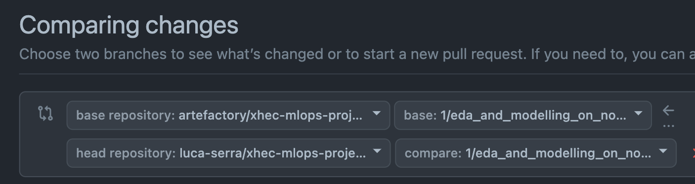
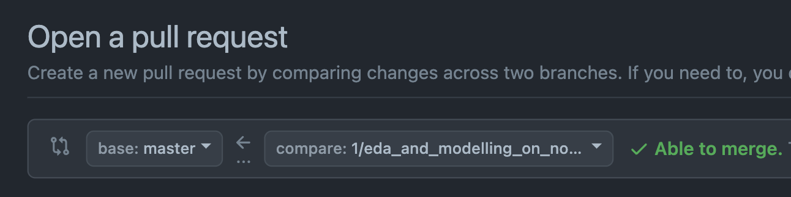

<div align="center">

# MLOps Project: Abalone Age Prediction

[]()
[](https://github.com/astral-sh/ruff)
[](https://github.com/artefactory/xhec-mlops-project-student/blob/main/.pre-commit-config.yaml)
</div>

## 🎯 Project Overview

Welcome to your MLOps project! In this hands-on project, you'll build a complete machine learning system to predict the age of abalone (a type of sea snail) using physical measurements instead of the traditional time-consuming method of counting shell rings under a microscope.

**Your Mission**: Transform a simple ML model into a production-ready system with automated training, deployment, and prediction capabilities.

## 📊 About the Dataset

Traditionally, determining an abalone's age requires:
1. Cutting the shell through the cone
2. Staining it 
3. Counting rings under a microscope (very time-consuming!)

**Your Goal**: Use easier-to-obtain physical measurements (shell weight, diameter, etc.) to predict the age automatically.

📥 **Download**: Get the dataset from the [Kaggle page](https://www.kaggle.com/datasets/rodolfomendes/abalone-dataset)


## 🚀 Quick Start

### Prerequisites
- GitHub account
- [Kaggle account](https://www.kaggle.com/account/login?phase=startRegisterTab&returnUrl=%2F) (for dataset download)
- Python 3.10 or 3.11

### Setup Steps

1. **Fork this repository** 
   - ⚠️ **Important**: Uncheck "Copy the `main` branch only" to get all project branches
   
2. **Add your team members** as admins to your forked repository

3. **Set up your development environment**:
   ```bash
   # Create and activate a virtual environment
   uv sync 
   source venv/bin/activate # on Windows: venv\Scripts\activate

   # Install pre-commit hooks for code quality
    uv pip install pre-commit
    uv run pre-commit install
   ```

## 📋 What You'll Build

By the end of this project, you'll have created:

### 🤖 **Automated ML Pipeline** 
- Training workflows using Prefect
- Automatic model retraining on schedule
- Reproducible model and data processing

### 🌐 **Prediction API**
- REST API for real-time predictions
- Input validation with Pydantic
- Docker containerization

### 📊 **Production-Ready Code**
- Clean, well-documented code
- Automated testing and formatting
- Proper error handling 

## 📝 How to Work on This Project

### The Branch-by-Branch Approach

This project is organized into numbered branches, each representing a step in building your MLOps system. Think of it like a guided tutorial where each branch teaches you something new!

**Here's how it works**:

1. **Each branch = One pull request** with specific tasks
2. **Follow the numbers** (branch_1, branch_2, etc.) in order
3. **Read the PR instructions** (PR_1.md, PR_2.md, etc.) before starting
4. **Complete all TODOs** in that branch's code
5. **Create a pull request** when done
6. **Merge and move to the next branch**

### Step-by-Step Workflow

For each numbered branch:

```bash
# Switch to the branch
git checkout branch_number_i

# Get latest changes (except for branch_1)
git pull origin main
# Note: A VIM window might open - just type ":wq" to close it

# Push your branch
git push
```

Then:
1. 📖 Read the PR_i.md file carefully
2. 💻 Complete all the TODOs in the code  
3. 🔧 Test your changes
4. 📤 Open **ONE** pull request to your main branch
5. ✅ Merge the pull request
6. 🔄 Move to the next branch

> **💡 Pro Tip**: Always integrate your previous work when starting a new branch (except branch_1)!

### 🔍 Understanding Pull Requests

Pull Requests (PRs) are how you propose and review changes before merging them into your main codebase. They're essential for team collaboration!

**Important**: When creating a PR, make sure you're merging into YOUR forked repository, not the original:

❌ **Wrong** (merging to original repo):


✅ **Correct** (merging to your fork):


## 💡 Development Tips

### Managing Dependencies

Use uv to manage dependencies. Install or update packages with:

```bash
uv add <package>==<version>
```

Then sync the environment and regenerate the dependency files:

```bash
uv sync
```

### Code Quality
- The pre-commit hooks will automatically format your code
- Remove all TODOs and unused code before final submission
- Use clear variable names and add docstrings

## 📊 Evaluation Criteria

Your project will be evaluated on:

### 🔍 **Code Quality** 
- Clean, readable code structure
- Proper naming conventions  
- Good use of docstrings and type hints

### 🎨 **Code Formatting**
- Consistent style (automated with pre-commit)
- Professional presentation

### ⚙️ **Functionality** 
- Code runs without errors
- All requirements implemented correctly

### 📖 **Documentation & Reproducibility**
- Clear README with setup instructions
- Team member names and GitHub usernames
- Step-by-step instructions to run everything

### 🤝 **Collaboration**
- Effective use of Pull Requests
- Good teamwork and communication

---

## 🎯 Final Deliverables Checklist

When you're done, your repository should contain:

✅ **Automated Training Pipeline**
- [ ] Prefect workflows for model training
- [ ] Separate modules for training and inference  
- [ ] Reproducible model and encoder generation

✅ **Automated Deployment**  
- [ ] Prefect deployment for regular retraining

✅ **Production API**
- [ ] Working REST API for predictions
- [ ] Pydantic input validation
- [ ] Docker containerization

✅ **Professional Documentation**
- [ ] Updated README with team info
- [ ] Clear setup and run instructions
- [ ] All TODOs removed from code

---

**Ready to start? Head to branch_0 and read PR_0.md for your first task! 🚀**